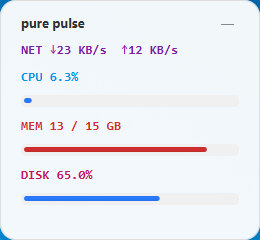

# 🩺 PurePulse

**一款基于 JavaFX 的极简、透明、桌面硬件监控悬浮窗。**

---

## ✨ 项目亮点

* **极简美学**：清新的白色半透明主题，扁平化设计，完美融入现代桌面。
* **低资源占用**：深度优化的 JVM 启动参数，内存占用稳定在 **40MB - 60MB** 之间。
* **四维监控**：
* **CPU**：实时占用百分比。
* **MEM**：物理内存实时占用。
* **NET**：实时下载/上传带宽速度。
* **DISK**：主硬盘空间使用率。


* **交互友好**：支持全局鼠标拖拽、右键快速隐藏、托盘常驻。

## 📸 界面预览

| 模式 | 预览图 |
| --- | --- |
| **标准视图** |  |

---

## 🚀 快速开始

### 1. 环境准备

* JDK 17 或更高版本。
* Maven 3.6+。

### 2. 运行项目

使用 Maven 直接启动：

```bash
mvn javafx:run

```

### 3. 构建可执行包

```text
双击build-exe.bat
```

---

## 🛠️ 性能调优说明 (重要)

为了保持项目的“轻量级”本质，建议在运行时指定以下 JVM 参数（已集成在 `pom.xml` 中）：

```bash
-Xms20m -Xmx40m -XX:+UseSerialGC -XX:MaxMetaspaceSize=32m

```

---

## 📂 项目结构

```text
PurePulse/
├── src/
│   ├── main/
│   │   ├── java/purepulse/        # 核心逻辑
│   │   └── resources/             # 图标及资源文件
├── pom.xml                        # Maven 配置与 JVM 参数
├── build-exe.bat                  # 构建可执行包
└── README.md

```

## 📜 开源协议

本项目采用 [MIT License](https://www.google.com/search?q=LICENSE) 协议。

---

### 📩 联系与贡献

如果你有更好的 UI 设计想法或内存优化方案，欢迎提交 Pull Request！
